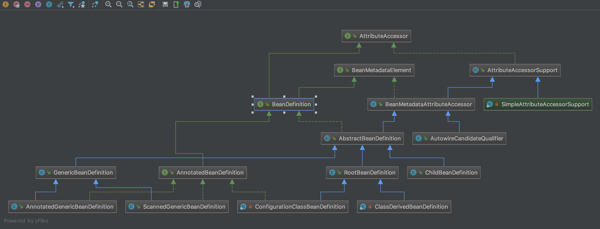

## BeanDefinition 

* BeanDefinition  
    * spring中用来描述Bean的信息，是创建Bean的基础，可以理解为Bean的基因，spring依此创建Bean
    * spring会将被自己托管的Bean构造出BeanDefinition注册在DefaultListableBeanFactory#beanDefinitionMap中，
        然后在getBean的时候进入AbstractAutowireCapableBeanFactory#createBeanInstance方法使用BeanDefinition实例化Bean
       
* BeanDefinition中的信息
    * beanClassName 类全名
    * scope bean的scope
    * lazyInit 是否延迟初始化
    * dependsOn depends依赖
    * autowireCandidate
    * primary 是否primary
    * factoryBeanName
    * factoryMethodName
    * constructorArgumentValues 构造参数
    * propertyValues 属性值
    * initMethodName 初始化方法名
    * destroyMethodName 销毁方法名
    * role
    * description 描述信息
    * isSingleton isPrototype
    * isAbstract 是否抽象类
    * resourceDescription
    * originatingBeanDefinition
   
* BeanDefinition继承关系

RootBeanDefinition 父BD  
ChildBeanDefinition 子BD new ChildBeanDefinition("parent_bd_name")  
GenericBeanDefinition 和RootBeanDefinition ChildBeanDefinition等同(setParentName("parent_bd_name"))  
AnnotatedGenericBeanDefinition 以@Configuration标注的  
ConfigurationClassBeanDefinition 以@Bean标注的  
ScannedGenericBeanDefinition 以@Component标注的  

