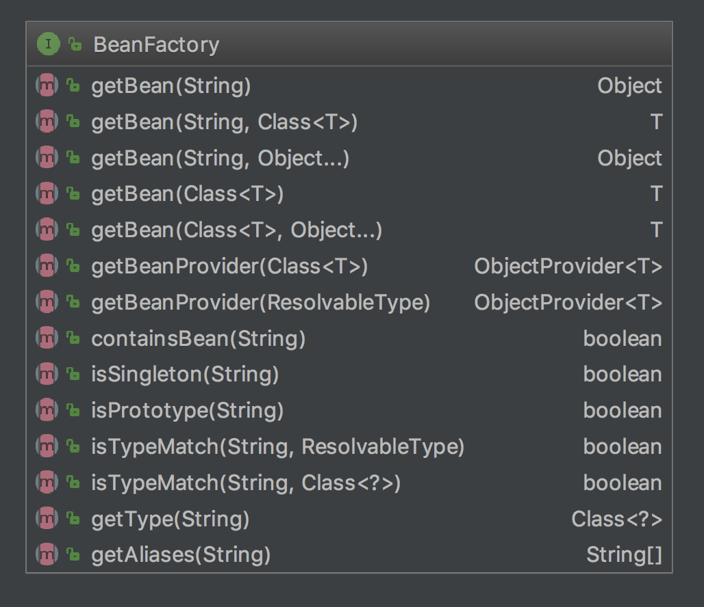
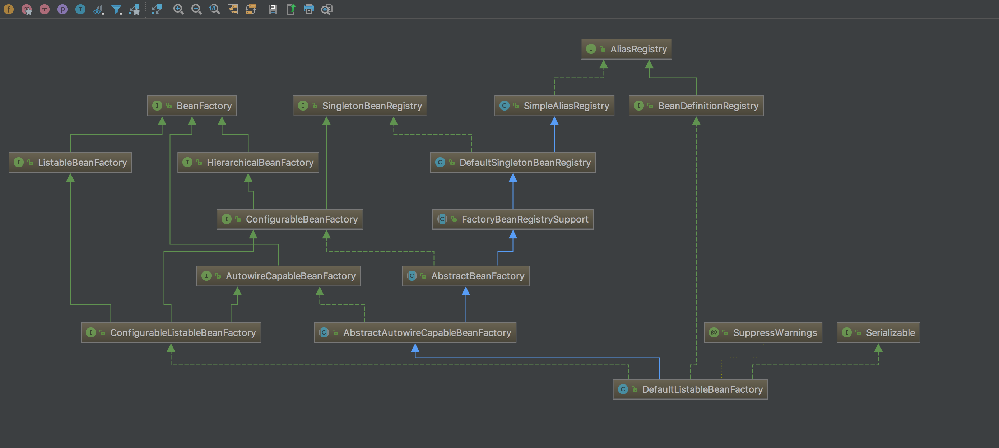

# BeanFactory--spring的bean工厂  
---  
**1. BeanFactory：IOC(Inversion of Control)容器的顶层接口**    
* 用来负责bean的生命周期
* 维护对象之间的关系  


**2. 接口列表**  


+  ```java
    /**
    * 根据name在bean工厂中检索
    */
	Object getBean(String name) throws BeansException;
	
    ```
+  ```java
    /**
    * 在#getBean(name)的基础上加类型转换
    * 类型不一致抛出BeanNotOfRequiredTypeException
    */
    <T> T getBean(String name, Class<T> requiredType) throws BeansException;
    ```

+ ```java
    /**
    * 在#getBean(name)的基础上加创建bean的参数
    * 只有在新创建对象的时候用到参数
    */
    Object getBean(String name, Object... args) throws BeansException;
    ```
    <p>
    以上3个方法都会进去到org.springframework.beans.factory.support.AbstractBeanFactory#doGetBean中
    
    ```java
     //typeCheckOnly=false
     protected <T> T doGetBean(final String name, @Nullable final Class<T> requiredType,
                @Nullable final Object[] args, boolean typeCheckOnly) throws BeansException {
     
            final String beanName = transformedBeanName(name);
            Object bean;
     
            //去org.springframework.beans.factory.support.DefaultSingletonBeanRegistry#singletonObjects中找
            Object sharedInstance = getSingleton(beanName);
            //singletonObjects中找到了并且参数为空
            if (sharedInstance != null && args == null) {
                //...省略
                bean = getObjectForBeanInstance(sharedInstance, name, beanName, null);
            }
            //singletonObjects未找到说明是原型Bean或者是单利Bean的第一次创建
            else {
                // Fail if we're already creating this bean instance:
                // We're assumably within a circular reference.
                if (isPrototypeCurrentlyInCreation(beanName)) {
                    throw new BeanCurrentlyInCreationException(beanName);
                }
     
                // Check if bean definition exists in this factory.
                BeanFactory parentBeanFactory = getParentBeanFactory();
                //父容器不为空并且当前容器中没有bd，交给父容器处理
                if (parentBeanFactory != null && !containsBeanDefinition(beanName)) {
                    // Not found -> check parent.
                    String nameToLookup = originalBeanName(name);
                    //父容器是AbstractBeanFactory类型，返回调用父容器的doGetBean得到的对象
                    if (parentBeanFactory instanceof AbstractBeanFactory) {
                        return ((AbstractBeanFactory) parentBeanFactory).doGetBean(
                                nameToLookup, requiredType, args, typeCheckOnly);
                    }
                    else if (args != null) {
                        // Delegation to parent with explicit args.
                        return (T) parentBeanFactory.getBean(nameToLookup, args);
                    }
                    else if (requiredType != null) {
                        // No args -> delegate to standard getBean method.
                        return parentBeanFactory.getBean(nameToLookup, requiredType);
                    }
                    else {
                        return (T) parentBeanFactory.getBean(nameToLookup);
                    }
                }
     
                if (!typeCheckOnly) {
                    markBeanAsCreated(beanName);
                }
     
                try {
                    final RootBeanDefinition mbd = getMergedLocalBeanDefinition(beanName);
                    checkMergedBeanDefinition(mbd, beanName, args);
     
                    // Guarantee initialization of beans that the current bean depends on.
                    //处理所有的DependsOn
                    String[] dependsOn = mbd.getDependsOn();
                    if (dependsOn != null) {
                        for (String dep : dependsOn) {
                            if (isDependent(beanName, dep)) {
                                throw new BeanCreationException(mbd.getResourceDescription(), beanName,
                                        "Circular depends-on relationship between '" + beanName + "' and '" + dep + "'");
                            }
                            registerDependentBean(dep, beanName);
                            try {
                                // 获取每一个DependsOn
                                getBean(dep);
                            }
                            catch (NoSuchBeanDefinitionException ex) {
                                throw new BeanCreationException(mbd.getResourceDescription(), beanName,
                                        "'" + beanName + "' depends on missing bean '" + dep + "'", ex);
                            }
                        }
                    }
     
                    // Create bean instance.
                    // 单利
                    if (mbd.isSingleton()) {
                        sharedInstance = getSingleton(beanName, () -> {
                            try {
                              // 创建单利Bean
                                return createBean(beanName, mbd, args);
                            }
                            catch (BeansException ex) {
                                // Explicitly remove instance from singleton cache: It might have been put there
                                // eagerly by the creation process, to allow for circular reference resolution.
                                // Also remove any beans that received a temporary reference to the bean.
                                destroySingleton(beanName);
                                throw ex;
                            }
                        });
                        bean = getObjectForBeanInstance(sharedInstance, name, beanName, mbd);
                    }
                   // 原型
                    else if (mbd.isPrototype()) {
                        // It's a prototype -> create a new instance.
                        Object prototypeInstance = null;
                        try {
                            //标记原型Bean正在创建
                            beforePrototypeCreation(beanName);
                            //创建原型Bean
                            prototypeInstance = createBean(beanName, mbd, args);
                        }
                        finally {
                            //清除标记
                            afterPrototypeCreation(beanName);
                        }
                        bean = getObjectForBeanInstance(prototypeInstance, name, beanName, mbd);
                    }
                    // Scope Bean
                    else {
                        String scopeName = mbd.getScope();
                        final Scope scope = this.scopes.get(scopeName);
                        if (scope == null) {
                            throw new IllegalStateException("No Scope registered for scope name '" + scopeName + "'");
                        }
                        try {
                            Object scopedInstance = scope.get(beanName, () -> {
                                beforePrototypeCreation(beanName);
                                try {
                                    return createBean(beanName, mbd, args);
                                }
                                finally {
                                    afterPrototypeCreation(beanName);
                                }
                            });
                            bean = getObjectForBeanInstance(scopedInstance, name, beanName, mbd);
                        }
                        catch (IllegalStateException ex) {
                            throw new BeanCreationException(beanName,
                                    "Scope '" + scopeName + "' is not active for the current thread; consider " +
                                    "defining a scoped proxy for this bean if you intend to refer to it from a singleton",
                                    ex);
                        }
                    }
                }
                catch (BeansException ex) {
                    cleanupAfterBeanCreationFailure(beanName);
                    throw ex;
                }
            }
     
            // requiredType不为空并且和检索或创建的bean类型匹配，做convert操作
            // Check if required type matches the type of the actual bean instance.
            if (requiredType != null && !requiredType.isInstance(bean)) {
                try {
                    T convertedBean = getTypeConverter().convertIfNecessary(bean, requiredType);
                    if (convertedBean == null) {
                        throw new BeanNotOfRequiredTypeException(name, requiredType, bean.getClass());
                    }
                    return convertedBean;
                }
                catch (TypeMismatchException ex) {
                    if (logger.isTraceEnabled()) {
                        logger.trace("Failed to convert bean '" + name + "' to required type '" +
                                ClassUtils.getQualifiedName(requiredType) + "'", ex);
                    }
                    throw new BeanNotOfRequiredTypeException(name, requiredType, bean.getClass());
                }
            }
            return (T) bean;
        }       
          	
     ```
     
     ```java
      //三种不同模式Bean创建Bean代码会调用到AbstractAutowireCapableBeanFactory#createBean(java.lang.String, org.springframework.beans.factory.support.RootBeanDefinition, java.lang.Object[])
      @Override
      	protected Object createBean(String beanName, RootBeanDefinition mbd, @Nullable Object[] args)
      			throws BeanCreationException {
      
      		if (logger.isTraceEnabled()) {
      			logger.trace("Creating instance of bean '" + beanName + "'");
      		}
      		RootBeanDefinition mbdToUse = mbd;
      
      		// Make sure bean class is actually resolved at this point, and
      		// clone the bean definition in case of a dynamically resolved Class
      		// which cannot be stored in the shared merged bean definition.
      		Class<?> resolvedClass = resolveBeanClass(mbd, beanName);
      		if (resolvedClass != null && !mbd.hasBeanClass() && mbd.getBeanClassName() != null) {
      			mbdToUse = new RootBeanDefinition(mbd);
      			mbdToUse.setBeanClass(resolvedClass);
      		}
      
      		// Prepare method overrides.
      		try {
      			mbdToUse.prepareMethodOverrides();
      		}
      		catch (BeanDefinitionValidationException ex) {
      			throw new BeanDefinitionStoreException(mbdToUse.getResourceDescription(),
      					beanName, "Validation of method overrides failed", ex);
      		}
      
      		try {
    		    //容器中是否注册过InstantiationAwareBeanPostProcessor，
  		        //如果有返回InstantiationAwareBeanPostProcessor#postProcessBeforeInstantiation第一个非空对象（替代后续的实例化操作），
		        //然后调用BeanPostProcessor#postProcessAfterInitialization完成初始化之后的操作
      			// Give BeanPostProcessors a chance to return a proxy instead of the target bean instance.
      			Object bean = resolveBeforeInstantiation(beanName, mbdToUse);
      			if (bean != null) {
      				return bean;
      			}
      		}
      		catch (Throwable ex) {
      			throw new BeanCreationException(mbdToUse.getResourceDescription(), beanName,
      					"BeanPostProcessor before instantiation of bean failed", ex);
      		}
      
      		try {
      			Object beanInstance = doCreateBean(beanName, mbdToUse, args);
      			if (logger.isTraceEnabled()) {
      				logger.trace("Finished creating instance of bean '" + beanName + "'");
      			}
      			return beanInstance;
      		}
      		catch (BeanCreationException | ImplicitlyAppearedSingletonException ex) {
      			// A previously detected exception with proper bean creation context already,
      			// or illegal singleton state to be communicated up to DefaultSingletonBeanRegistry.
      			throw ex;
      		}
      		catch (Throwable ex) {
      			throw new BeanCreationException(
      					mbdToUse.getResourceDescription(), beanName, "Unexpected exception during bean creation", ex);
      		}
      	}
     ```
     ```java

      //doCreateBean
    protected Object doCreateBean(final String beanName, final RootBeanDefinition mbd, final @Nullable Object[] args)
    			throws BeanCreationException {
    
    		// Instantiate the bean.
    		BeanWrapper instanceWrapper = null;
    		if (mbd.isSingleton()) {
    			instanceWrapper = this.factoryBeanInstanceCache.remove(beanName);
    		}
    		if (instanceWrapper == null) {
  		        //这里创建了目标bean
    			instanceWrapper = createBeanInstance(beanName, mbd, args);
    		}
    		final Object bean = instanceWrapper.getWrappedInstance();
    		Class<?> beanType = instanceWrapper.getWrappedClass();
    		if (beanType != NullBean.class) {
    			mbd.resolvedTargetType = beanType;
    		}
    
    		// Allow post-processors to modify the merged bean definition.
    		synchronized (mbd.postProcessingLock) {
    			if (!mbd.postProcessed) {
    				try {
  				        //处理注册的MergedBeanDefinitionPostProcessor
    					applyMergedBeanDefinitionPostProcessors(mbd, beanType, beanName);
    				}
    				catch (Throwable ex) {
    					throw new BeanCreationException(mbd.getResourceDescription(), beanName,
    							"Post-processing of merged bean definition failed", ex);
    				}
    				mbd.postProcessed = true;
    			}
    		}
    
    		// Eagerly cache singletons to be able to resolve circular references
    		// even when triggered by lifecycle interfaces like BeanFactoryAware.
    		boolean earlySingletonExposure = (mbd.isSingleton() && this.allowCircularReferences &&
    				isSingletonCurrentlyInCreation(beanName));
    		if (earlySingletonExposure) {
    			if (logger.isTraceEnabled()) {
    				logger.trace("Eagerly caching bean '" + beanName +
    						"' to allow for resolving potential circular references");
    			}
    			addSingletonFactory(beanName, () -> getEarlyBeanReference(beanName, mbd, bean));
    		}
    
    		// Initialize the bean instance.
    		Object exposedObject = bean;
    		try {
  		        //这里处理InstantiationAwareBeanPostProcessor#postProcessAfterInstantiation 
		        //处理autowireByName和autowireByType属性依赖
    			populateBean(beanName, mbd, instanceWrapper);
  			    //这里先后调用BeanPostProcessor#postProcessBeforeInitialization、InitializingBean#afterPropertiesSet、 BeanPostProcessor#postProcessAfterInitialization
    			exposedObject = initializeBean(beanName, exposedObject, mbd);
    		}
    		catch (Throwable ex) {
    			if (ex instanceof BeanCreationException && beanName.equals(((BeanCreationException) ex).getBeanName())) {
    				throw (BeanCreationException) ex;
    			}
    			else {
    				throw new BeanCreationException(
    						mbd.getResourceDescription(), beanName, "Initialization of bean failed", ex);
    			}
    		}
    
    		if (earlySingletonExposure) {
    			Object earlySingletonReference = getSingleton(beanName, false);
    			if (earlySingletonReference != null) {
    				if (exposedObject == bean) {
    					exposedObject = earlySingletonReference;
    				}
    				else if (!this.allowRawInjectionDespiteWrapping && hasDependentBean(beanName)) {
    					String[] dependentBeans = getDependentBeans(beanName);
    					Set<String> actualDependentBeans = new LinkedHashSet<>(dependentBeans.length);
    					for (String dependentBean : dependentBeans) {
    						if (!removeSingletonIfCreatedForTypeCheckOnly(dependentBean)) {
    							actualDependentBeans.add(dependentBean);
    						}
    					}
    					if (!actualDependentBeans.isEmpty()) {
    						throw new BeanCurrentlyInCreationException(beanName,
    								"Bean with name '" + beanName + "' has been injected into other beans [" +
    								StringUtils.collectionToCommaDelimitedString(actualDependentBeans) +
    								"] in its raw version as part of a circular reference, but has eventually been " +
    								"wrapped. This means that said other beans do not use the final version of the " +
    								"bean. This is often the result of over-eager type matching - consider using " +
    								"'getBeanNamesOfType' with the 'allowEagerInit' flag turned off, for example.");
    					}
    				}
    			}
    		}
    
    		// Register bean as disposable.
    		try {
  		        //是否需要注册DisposableBean
    			registerDisposableBeanIfNecessary(beanName, bean, mbd);
    		}
    		catch (BeanDefinitionValidationException ex) {
    			throw new BeanCreationException(
    					mbd.getResourceDescription(), beanName, "Invalid destruction signature", ex);
    		}
    
    		return exposedObject;
    	}
     ```
    </p>

+ ```java
    /**
    * 按类型检索
    * 没有抛出NoSuchBeanDefinitionException
    * 多余一个抛出NoUniqueBeanDefinitionException
    */
    <T> T getBean(Class<T> requiredType) throws BeansException;
    ```
+ ```java
    /**
    * 在#getBean(Class<T>)的基础上加创建bean的参数
    */
    <T> T getBean(Class<T> requiredType, Object... args) throws BeansException;
    ```

    <p>  
    以上2个方法都会进入到org.springframework.beans.factory.support.DefaultListableBeanFactory#resolveBean
    
    ```java
      @Nullable
               private <T> T resolveBean(ResolvableType requiredType, @Nullable Object[] args, boolean nonUniqueAsNull) {
                   NamedBeanHolder<T> namedBean = resolveNamedBean(requiredType, args, nonUniqueAsNull);
                   if (namedBean != null) {
                       return namedBean.getBeanInstance();
                   }
                   BeanFactory parent = getParentBeanFactory();
                   if (parent instanceof DefaultListableBeanFactory) {
                       return ((DefaultListableBeanFactory) parent).resolveBean(requiredType, args, nonUniqueAsNull);
                   }
                   else if (parent != null) {
                       ObjectProvider<T> parentProvider = parent.getBeanProvider(requiredType);
                       if (args != null) {
                           return parentProvider.getObject(args);
                       }
                       else {
                           return (nonUniqueAsNull ? parentProvider.getIfUnique() : parentProvider.getIfAvailable());
                       }
                   }
                   return null;
               }
    ```       
    </p>

**3. BeanFactory类图**



